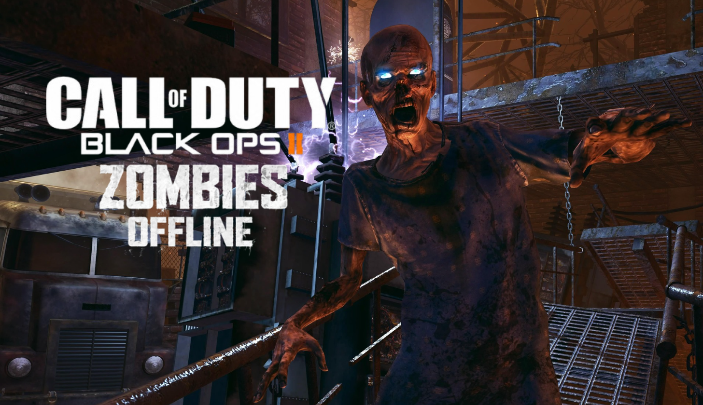

<h1 align="center">BO2Z-Offline</h1>

<p align="center"><strong>Made by J_axon</strong></p>

<p align="center"></p>

BO2Z-Offline lets owners of the original Steam **Black Ops II Zombies** play Solo without an Internet connection. Its launcher starts the unmodified game and connects it to local offline services. It does not replace the game executable, Steam API, audio, or graphics DLLs. This is separate from the BO2 VR project.

> **Steam Offline Mode is highly recommended** when using the launcher. It can work with Steam online, but BO2's own online behavior may be less predictable in some situations. Steam must be installed and your account must own the game.

## Support the project

BO2Z-Offline is completely free, and donating is entirely optional. Nothing is locked behind payment and you never need to donate to download, use, or modify the mod. If you enjoy it and would like to support future work, you can help on Ko-fi:

### [ko-fi.com/j_axon](https://ko-fi.com/j_axon)

## Your online and offline saves

Offline play starts a **separate save**. Your online rank, banked points, and other progress may look missing offline, but they are not erased. Offline rank and progress persist between offline sessions in `BO2Z-Offline/data/offline-profiles/<SteamID>/`. Launch Zombies normally through Steam to use your original online profile. The two profiles never merge or overwrite one another. Each Steam account has its own offline folder.

Back up `offline-profiles` to keep your offline progress, and exit matches normally so the game can save. Never share this folder or your logs in a public release.

## Install and play

You need Windows, Steam, an owned copy of Black Ops II Zombies, and the supported original `t6zm.exe` build (SHA-256 `F6F7104AF2BD0C2B931EA1E739969E85845E499AFFBF686144C6B490B344AB1E`). No VR runtime or Plutonium installation is needed.

1. Close Zombies and download the [complete BO2Z-Offline 1.0.0 ZIP](downloads/BO2Z-Offline-1.0.0.zip). GitHub's automatic **Source code** ZIP is not the ready-to-play build.
2. In Steam, right-click **Call of Duty: Black Ops II - Zombies** and choose **Manage > Browse local files**. Find the folder containing `t6zm.exe`.
3. From the ZIP's `Copy into Black Ops II folder`, copy `BO2Z-Offline-Launcher.exe` and the entire `BO2Z-Offline` folder beside `t6zm.exe`. Keep the DLL and `data/pub` files together.
4. Preferably switch Steam to **Offline Mode**, then open `BO2Z-Offline-Launcher.exe` and press **Play Offline**. Use BO2's menus to start Solo normally.

**Offline Status** is on by default. It shows small “In Offline Mode” text in the game's top-left corner. The toggle only affects that visual label, not saves or connectivity. The launcher stays open in the background while the label is enabled and closes with the game. To play normally online, close Zombies and start it directly through Steam instead of the offline launcher.

```text
Call of Duty Black Ops II/
├── t6zm.exe
├── BO2Z-Offline-Launcher.exe
└── BO2Z-Offline/
    ├── BO2Z-Offline.dll
    └── data/
        ├── pub/                required game publisher resources
        └── offline-profiles/   created for each player; never shipped
```

The launcher checks the executable and required files before starting. For problems, check `BO2Z-Offline/BO2Z-Offline.log`, but review it for account or system information before sharing. This release targets **offline Zombies Solo**; it does not claim multiplayer LAN, public matchmaking, cloud sync, global leaderboards, or compatibility with other `t6zm.exe` builds.

## Build from source

Use Windows, PowerShell 7, CMake 3.22+, Visual Studio 2022 with **Desktop development with C++**, and the Windows SDK. Build **Win32/x86**, not x64. LibTomCrypt, zlib, and the required publisher resources are included; the BO2 executable and personal saves are not.

```powershell
git clone https://github.com/Ghostx10742/BO2Z-Offline.git
Set-Location .\BO2Z-Offline
cmake -S . -B build -A Win32
cmake --build build --config Release
ctest --test-dir build -C Release --output-on-failure
.\tools\package-release.ps1
```

The binaries are in `build/Release/`. The packaging script checks the nine publisher files and writes `dist/BO2Z-Offline-1.0.0-local-build.zip` without including saves or logs. The checked-in 1.0.0 release was rebuilt from this source and passed the automated tests; **this newly versioned binary has not yet had a separate live gameplay test**.

## License and credits

Original BO2Z-Offline code is under [Apache License 2.0](LICENSE). You may fork the repo or use the code in your own project. If you distribute reused or modified work, preserve the license and [NOTICE](NOTICE), mark your changes, clearly credit **J_axon**, and link to the [original repository](https://github.com/Ghostx10742/BO2Z-Offline). Apache 2.0 does not require a GitHub fork.

All creation and direction credits go to **J_axon**. Special thanks to tester **obesikaas**. LibTomCrypt and zlib keep their separate licenses in [third-party notices](THIRD-PARTY-NOTICES.md). Call of Duty game files, artwork, and trademarks remain their owners' property and are not covered by the code license. This is an independent fan project, not affiliated with Activision or Treyarch.

## AI disclosure

AI was used during the development of this project, mainly for revisions, inquiries, and things I just did not know. This does not mean the mod was fully AI-made, but rather that AI was used as part of the development process. I wanted to disclose this for people who may have a problem with AI being involved and may not want anything to do with it. Even though I disagree with your view on AI, I still respect your opinion on the subject.
